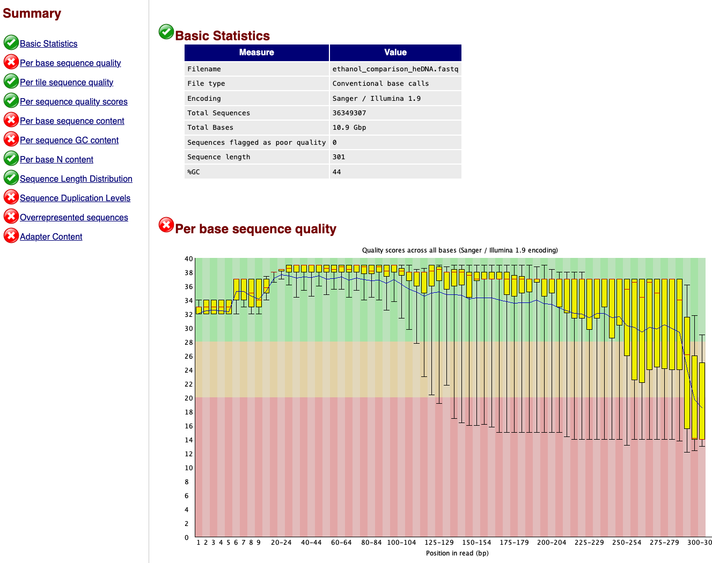
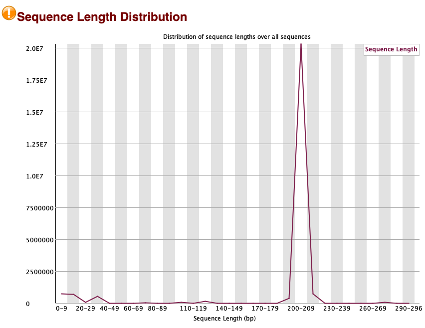
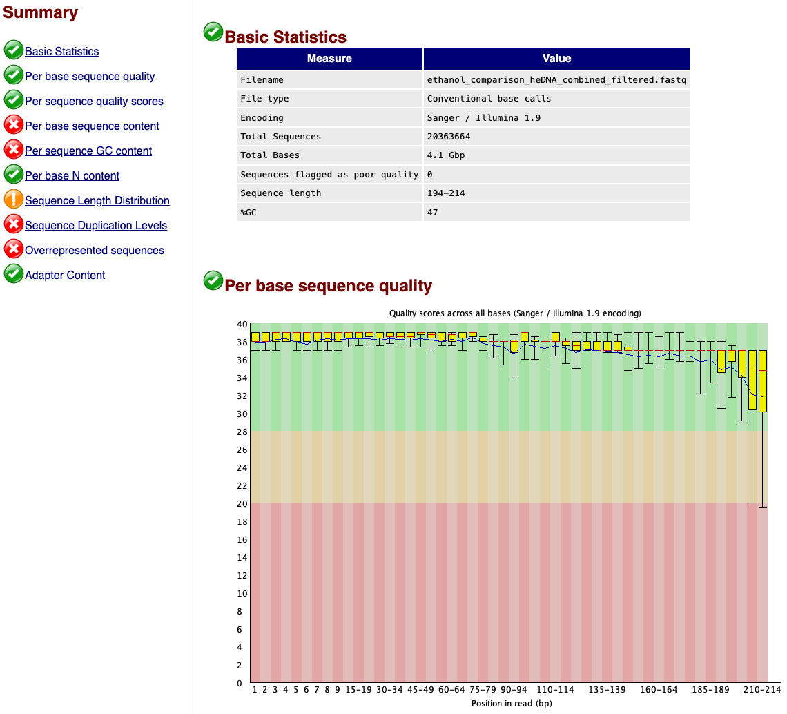

# Marsden objective 1: non-destructive heDNA

## 1. Introduction

This GitHub repository serves as a comprehensive guide for the bioinformatic and statistical analysis of the ethanol comparison project, associated with the Marsden Fast-Start funding MFP-UOO002116.

## 2. Experimental design

The primary objective of this experiment is to assess the possibility of non-destructive heDNA recovery from museum-stored marine sponge specimens through DNA extraction from the ethanol in which specimens are stored. To verify non-destructive sampling as a suitable methodological choice for specimens across the phylum Porifera, we selected one specimen from the three major classes due to differing internal skeletal structures, including Hexactinellida (hexagonal silica spicules), Demospongiae (spongin), and Calcarea (calcium carbonate spicules). A detailed list with metadata for each specimen can be found below.

| Cat. # | Class | Species | Date | Latitude | Longitude | Depth |
| :---- | :---- | :---- | :---- | :---- | :---- | :---- |
| 35574 | Calcarea | Petrobiona sp. | 09/02/2008 | -73.1245 | 174.3205 | 321 |
| 37535 | Demospongia | Homaxinella sp. | 24/02/2008 | -72.0093 | 173.2238 | 850 |
| 37124 | Hexactinellida | Rossella fibulata | 21/02/2008 | -72.5903 | 175.3423 | 479 |

For each sepcimen, DNA was extracted from 10 tissue biopsies without removal of excess ethanol and 10 tissue biopsies whereby excess ethanol was removed by absorbance of lint-free kimwipes. To test heDNA recovery from ethanol, we extracted DNA through (1) 1 ml evaporation, (2) 1 ml centrifugation, (3) 1 ml precipitation, (4) 1 ml filtration, and (5) 10 ml filtration. For each non-destructive method, 10 replicates were processed to enable statistical comparison between treatments.

After DNA extraction, the total DNA concentration was measured via Qubit, while DNA purity was assessed by investigating the 260/280 and 260/230 absorbence ratios measured via Denovix. To amplify heDNA signals associated with fish species (Fish16SF: 5’-GACCCTATGGAGCTTTAGAC-3’; Fish16S2R: 5’-CGCTGTTATCCCTADRGTAACT-3’), we employed a metabarcoding approach. This primer set was chosen over the MiFish-U primer set, as it does not co-amplify human DNA, a potential contaminant signal for museum-stored specimens that have been handled repeatedly for morphometric analysis.

**While we're unsure at this stage, genome sequencing was also conducted on the ONT platform to assess the possibility of retrieving (mito) genome sequences from non-destructive methods. However, we'll have to wait until we receive the results later on if this will be included in the manuscript.**

## 3. Bioinformatic analysis

For the bioinformatic analysis of the metabarcoding data, we will employ a standard [cutadapt v4.4](https://cutadapt.readthedocs.io/en/stable/) and [VSEARCH v2.16.0_macos_aarch64](https://github.com/torognes/vsearch) pipeline, followed by taxonomy assignment through a local blastn search against a curated reference database generated by [CRABS v0.1.8](https://github.com/gjeunen/reference_database_creator), and a final data curation step using [tombRaider v1.0](https://github.com/gjeunen/tombRaider) to remove PCR artefacts.

## 3.1 Starting files

For this project, we need six files for the bioinformatic analysis, including three sequence files and three metadata files. File names are listed below. All files (sequencing and metadata) can be downloaded from [figshare](https://figshare.com/account/home#/projects/184573).

Sequence file names:

1. 8437-P1-00-01_S1_L001_R1_001.fastq.gz
2. 8482-P1-0-1_S1_L001_R1_001.fastq.gz
3. 8482-P2-00-01_S1_L001_R1_001.fastq.gz

Metadata file names:

1. 8437-P1metadata.fasta
2. 8482-P1metadata.fasta
3. 8482-P2metadata.fasta

Before we start with our analysis, let's reformat these files to make it easier for us. For example, we can merge all sequencing files and all metadata files into one file per type, as the code can then be run once, rather than in a loop. Additionally, we need to strip the `^` and the `$` from the metadata files, as this approach won't be used in our pipeline. First, let's merge the sequence files. To do this, we need to unzip the files prior to merging them.

```{code-block} bash
gunzip *.fastq.gz
cat *.fastq > ethanol_comparison_heDNA.fastq
rm -r *001.fastq
```

Next, we can reformat the metadata files using the python script below. At the same time, it will output the merged metadata file.

```{code-block} python
#!/usr/bin/env Python3
input_file_list = ['8437-P1metadata.fasta', '8482-P1metadata.fasta', '8482-P2metadata.fasta']
merged_input_files = []
for item in input_file_list:
   with open(item, 'r') as infile:
      for line in infile:
         line = line.lstrip('^').rstrip('$\n') + '\n'
         merged_input_files.append(line)
with open('ethanol_comparison_heDNA_metadata.fasta', 'w') as outfile:
   for item in merged_input_files:
      outfile.write(item)
```

## 3.2 Raw sequence data quality check

Before we get started with the bioinformatic analysis, we will check the quality and integrity of the raw sequence file using [FastQC v0.12.1](https://www.bioinformatics.babraham.ac.uk/projects/fastqc/).

```{code-block} bash
mkdir 1.fastqc_raw
fastqc ethanol_comparison_heDNA.fastq -o 1.fastqc_raw
```



## 3.3 Demultiplexing

Once quality is checked, we can assign sequences to their respective samples, i.e., demultiplexing. For this step, we will use cutadapt. At the same time as removing the barcodes from the amplicon, we will remove primer-binding regions as well, by setting the "adapter" to the barcode sequence + primer sequence.

```{code-block} bash
mkdir 2.demultiplex
cutadapt ethanol_comparison_heDNA.fastq -g file:'ethanol_comparison_heDNA_metadata.fasta' -o 2.demultiplex/{name}.fastq --discard-untrimmed --no-indels -e 0 --cores=0
```

```{admonition}
=== Summary ===

Total reads processed:              36,349,307
Reads with adapters:                24,149,058 (66.4%)

== Read fate breakdown ==
Reads discarded as untrimmed:       12,200,249 (33.6%)
Reads written (passing filters):    24,149,058 (66.4%)

Total basepairs processed: 10,941,141,407 bp
Total written (filtered):  4,440,167,368 bp (40.6%)
```

## 3.4 Quality filtering

We can further filter the remaining reads on several quality parameters using VSEARCH, including minimum length, maximum length, maximum expected errors, and maximum number of ambiguous bases. Prior to quality filtering, rename sequence headers to include sample ID and merge all files.

```{code-block} bash
mkdir 3.renamed 4.combined
for fq in 2.demultiplex/*.fastq
do
relabel=${fq/2.demultiplex\//}
vsearch --fastq_filter ${fq} --fastqout ${fq/2.demultiplex/3.renamed/} --relabel ${relabel/.fastq/}.
done
cat 3.renamed/*.fastq > 4.combined/ethanol_comparison_heDNA_combined.fastq
```

After renaming the sequence ID's for each file and all samples merged, we can check the quality and amplicon size range using FastQC. This will be essential to set the minimum and maximum read length thresholds during quality filtering.

```{code-block} bash
mkdir 5.fastqc_pre_filter
fastqc 4.combined/ethanol_comparison_heDNA_combined.fastq -o 5.fastqc_pre_filter
```



```{code-block} bash
mkdir 6.filtered
vsearch --fastq_filter 4.combined/ethanol_comparison_heDNA_combined.fastq --fastq_maxee 1.0 --fastq_minlen 194 --fastq_maxlen 214 --fastq_maxns 0 --fastqout 6.filtered/ethanol_comparison_heDNA_combined_filtered.fastq --fastaout 6.filtered/ethanol_comparison_heDNA_combined_filtered.fasta
```

```{admonition}
vsearch v2.16.0_macos_aarch64, 16.0GB RAM, 8 cores
https://github.com/torognes/vsearch
Reading input file 100%  
20363664 sequences kept (of which 0 truncated), 3724301 sequences discarded.
```

After quality filtering, we can run FastQC again to check if quality filtering was successful.

```{code-block} bash
mkdir 7.fastqc_post_filter
fastqc 6.filtered/ethanol_comparison_heDNA_combined_filtered.fastq -o 7.fastqc_post_filter
```



### 3.5 Dereplication

We will now use the fasta file to dereeplicate the data using VSEARCH, i.e., find unique sequences.

```{code-block} bash
mkdir 8.dereplication
vsearch --derep_fulllength 6.filtered/ethanol_comparison_heDNA_combined_filtered.fasta --relabel uniq. --output 8.dereplication/ethanol_comparison_heDNA_combined_filtered_derep.fasta --sizeout
```

```{admonition}
vsearch v2.16.0_macos_aarch64, 16.0GB RAM, 8 cores
https://github.com/torognes/vsearch
Dereplicating file 6.filtered/ethanol_comparison_heDNA_combined_filtered.fasta 100%  
4114456709 nt in 20363664 seqs, min 194, max 214, avg 202
Sorting 100%
2749957 unique sequences, avg cluster 7.4, median 1, max 1666279
Writing output file 100% 
```

### 3.6 Denoising

Using the unique sequence file, we will denoise the dataset using VSEARCH.

```{code-block} bash
mkdir 9.denoised
vsearch --cluster_unoise 8.dereplication/ethanol_comparison_heDNA_combined_filtered_derep.fasta --sizein --sizeout --relabel denoised. --centroids 9.denoised/ethanol_comparison_heDNA_combined_filtered_derep_denoised.fasta
```

```{admonition}
vsearch v2.16.0_macos_aarch64, 16.0GB RAM, 8 cores
https://github.com/torognes/vsearch
Reading file 8.dereplication/ethanol_comparison_heDNA_combined_filtered_derep.fasta 100%  
23696444 nt in 117334 seqs, min 194, max 214, avg 202
minsize 8: 2632623 sequences discarded.
Masking 100% 
Sorting by abundance 100%
Counting k-mers 100% 
Clustering 100%  
Sorting clusters 100%
Writing clusters 100% 
Clusters: 448 Size min 8, max 3894170, avg 261.9
Singletons: 0, 0.0% of seqs, 0.0% of clusters
```

### 3.7 Chimera removal

Unlike USEARCH, VSEARCH does not automatically remove chimeric sequences during denoising. Hence, we need to execute the following code to accomplish this.

```{code-block} bash
mkdir 10.final
vsearch --uchime3_denovo 9.denoised/ethanol_comparison_heDNA_combined_filtered_derep_denoised.fasta --sizein --nonchimeras 10.final/ethanol_comparison_heDNA_asvs.fasta --relabel asv.
```

```{admonition}
vsearch v2.16.0_macos_aarch64, 16.0GB RAM, 8 cores
https://github.com/torognes/vsearch
Reading file 9.denoised/ethanol_comparison_heDNA_combined_filtered_derep_denoised.fasta 100%  
90837 nt in 448 seqs, min 194, max 214, avg 203
Masking 100% 
Sorting by abundance 100%
Counting k-mers 100% 
Detecting chimeras 100%  
Found 339 (75.7%) chimeras, 109 (24.3%) non-chimeras,
and 0 (0.0%) borderline sequences in 448 unique sequences.
Taking abundance information into account, this corresponds to
44769 (0.3%) chimeras, 16737833 (99.7%) non-chimeras,
and 0 (0.0%) borderline sequences in 16782602 total sequences.
```

We now have created the ASVs for this project.

### 3.8 Count table

Now that we have created the ASVs, we can generate the count table using VSEARCH.

```{code-block} bash
vsearch --usearch_global 6.filtered/ethanol_comparison_heDNA_combined_filtered.fasta --db 10.final/ethanol_comparison_heDNA_asvs.fasta --strand plus --id 0.97 --otutabout 10.final/ethanol_comparison_heDNA_table.txt
```

```{admonition}
vsearch v2.16.0_macos_aarch64, 16.0GB RAM, 8 cores
https://github.com/torognes/vsearch
Reading file 10.final/ethanol_comparison_heDNA_asvs.fasta 100%  
22007 nt in 109 seqs, min 194, max 214, avg 202
Masking 100% 
Counting k-mers 100% 
Creating k-mer index 100% 
Searching 100%  
Matching unique query sequences: 20247244 of 20363664 (99.43%)
Writing OTU table (classic) 100%  
```

## 4. Taxonomy assignment

### 4.1 Reference database

For taxonomy assignment, we will generate a high-quality local reference database using CRABS. First, we will download the NCBI taxonomy information.

```{code-block} bash
mkdir 11.reference_db
cd 11.reference_db
crabs db_download -s taxonomy
```

Next, we will download data from three online repositories, including the MiFish database, EMBL, and NCBI.

```{code-block} bash
crabs db_download -s mitofish -o mitofish.fasta
crabs db_download -s embl -db 'VRT*' --output embl_vrt.fasta
crabs db_download -s embl -db 'MAM*' --output embl_mam.fasta
crabs db_download -s ncbi -db nucleotide
```

Once downloaded, we merge the different output files into a single file.

```{code-block} bash

```

## 5. *tombRaider* data curation

Once we have the three output files from the bioinformatic analysis and taxonomy assignment (1. ASV table: "ethanol_comparison_heDNA_table.txt"; 2. ASV fasta file: "ethanol_comparison_heDNA_asvs.fasta", 3. taxonomy assignment file: "ethanol_comparison_heDNA_asvs.fasta.nt.blastn"), we can further curate the data using [tombRaider v1.0](https://github.com/gjeunen/tombRaider). This step will attempt to remove all artefacts from the data before we conduct the statistical analysis.

## 6. Basic read stats

Now that we have all files and filtering steps conducted, we can count reads across the different filtering steps for all samples combined and per sample. This information can be put into the supplemental files and plotted as a bar graph. To accomplish this, we can execute the python scripts below.

The python script for total read count:

```{code-block} python
#! /usr/bin/env Python3
import os

# raw total read count
rawcount = 0
with open('ethanol_comparison_heDNA.fastq', 'r') as rawfile:
    for line in rawfile:
        rawcount += 1
rawcount = int(rawcount / 4)

# demultiplexed total read count
demultiplexcount = 0
demuxfilelist = os.listdir('2.demultiplex')
for demuxfile in demuxfilelist:
    with open(f'2.demultiplex/{demuxfile}', 'r') as demuxf:
        for line in demuxf:
            demultiplexcount += 1
demultiplexcount = int(demultiplexcount / 4)

# filtered total read count
filtercount = 0
with open(f'6.filtered/ethanol_comparison_heDNA_combined_filtered.fastq', 'r') as filterf:
    for line in filterf:
        filtercount += 1
filtercount = int(filtercount / 4)

# denoised total read count
denoisecount = 0
with open('9.denoised/ethanol_comparison_heDNA_combined_filtered_derep_denoised.fasta', 'r') as denoisef:
    for line in denoisef:
        if 'size=' in line:
            denoisecount += int(line.split('size=')[1].rstrip('\n'))

# final total read count
finalcount = 0
with open('10.final/ethanol_comparison_heDNA_table.txt', 'r') as finalf:
    for line in finalf:
        if line.startswith('asv'):
            asvcount = line.rstrip('\n').split('\t')[1:]
            for item in asvcount:
                finalcount += int(item)

print(f"raw total read count: {rawcount} ({(rawcount / rawcount * 100):.2f}%)")
print(f"demultiplexed total read count: {demultiplexcount} ({(demultiplexcount / rawcount * 100):.2f}%)")
print(f"filtered total read count: {filtercount} ({(filtercount / rawcount * 100):.2f}%)")
print(f"denoised total read count: {denoisecount} ({(denoisecount / rawcount * 100):.2f}%)")
print(f"final total read count: {finalcount} ({(finalcount / rawcount * 100):.2f}%)")
```

```{admonition}
raw total read count: 36349307 (100.00%)
demultiplexed total read count: 24149058 (66.44%)
filtered total read count: 20363664 (56.02%)
denoised total read count: 16782602 (46.17%)
final total read count: 20247244 (55.70%)
```

The python script for the per sample read count:

```{code-block} python
#! /usr/bin/env Python3
import os
import collections

# generate dictionary of all samples from metadata file
sampledict = collections.defaultdict(dict)
with open('ethanol_comparison_heDNA_metadata.fasta', 'r') as metadata:
    for line in metadata:
        if line.startswith('>'):
            sampleID = line.rstrip('\n').lstrip('>')
            sampledict[sampleID]

# read count after demultiplexing
demuxfilelist = os.listdir('2.demultiplex')
for demuxfile in demuxfilelist:
    demuxcount = 0
    with open(f'2.demultiplex/{demuxfile}', 'r') as demuxf:
        for line in demuxf:
            demuxcount += 1
    demuxcount = int(demuxcount / 4)
    demuxfileID = demuxfile.split('.')[0]
    sampledict[demuxfileID]['demuxcount'] = demuxcount

# read count after filtering
with open('6.filtered/ethanol_comparison_heDNA_combined_filtered.fasta', 'r') as filterf:
    for line in filterf:
        if line.startswith('>'):
            filterID = line.rstrip('\n').lstrip('>').split('.')[0]
            try:
                sampledict[filterID]['filtercount'] += 1
            except KeyError:
                sampledict[filterID]['filtercount'] = 1

# read count from ASV table (can't look at denoised data, as there is no mapping file available)
mapDict = {}
with open('10.final/ethanol_comparison_heDNA_table.txt', 'r') as finalf:
    for line in finalf:
        if line.startswith('#'):
            maplist = line.rstrip('\n').split('\t')[1:]
            for i in range(len(maplist)):
                mapDict[i] = maplist[i]
        else:
            readlist = line.rstrip('\n').split('\t')[1:]
            for i in range(len(readlist)):
                try:
                    sampledict[mapDict[i]]['finalcount'] += int(readlist[i])
                except KeyError:
                    sampledict[mapDict[i]]['finalcount'] = int(readlist[i])

# print read counts per sample
for key, value in sampledict.items():
    valuestring = ''
    for k, v in value.items():
        valuestring += ', ' + str(k) + ': ' + str(v)
    print(f'sample ID: {key}{valuestring}')
```

```{admonition}
sample ID: TW35_1, demuxcount: 143580, filtercount: 93988, finalcount: 92289
sample ID: TW35_2, demuxcount: 98243, filtercount: 23411, finalcount: 23356
sample ID: TW35_3, demuxcount: 244561, filtercount: 133649, finalcount: 132407
sample ID: TW35_4, demuxcount: 177352, filtercount: 81554, finalcount: 80822
sample ID: TW35_5, demuxcount: 161841, filtercount: 57836, finalcount: 57385
sample ID: TW35_6, demuxcount: 173331, filtercount: 75752, finalcount: 75495
sample ID: TW35_7, demuxcount: 114843, filtercount: 36955, finalcount: 36577
sample ID: TW35_8, demuxcount: 146863, filtercount: 87354, finalcount: 86404
sample ID: TW35_9, demuxcount: 219102, filtercount: 147861, finalcount: 145747
sample ID: TW35_10, demuxcount: 165332, filtercount: 89717, finalcount: 89009
sample ID: T35_1, demuxcount: 101810, filtercount: 61000, finalcount: 60397
sample ID: T35_2, demuxcount: 97229, filtercount: 45745, finalcount: 45494
sample ID: T35_3, demuxcount: 183769, filtercount: 81024, finalcount: 80538
sample ID: T35_4, demuxcount: 177932, filtercount: 78464, finalcount: 78119
sample ID: T35_5, demuxcount: 201563, filtercount: 107766, finalcount: 106995
sample ID: T35_6, demuxcount: 204849, filtercount: 121924, finalcount: 120954
sample ID: T35_7, demuxcount: 152911, filtercount: 92192, finalcount: 91502
sample ID: T35_8, demuxcount: 125022, filtercount: 79136, finalcount: 78531
sample ID: T35_9, demuxcount: 177188, filtercount: 104396, finalcount: 104144
sample ID: T35_10, demuxcount: 226154, filtercount: 165870, finalcount: 164306
sample ID: F135_1, demuxcount: 130786, filtercount: 109254, finalcount: 108663
sample ID: F135_2, demuxcount: 78275, filtercount: 48764, finalcount: 48603
sample ID: F135_3, demuxcount: 89875, filtercount: 43985, finalcount: 43739
sample ID: F135_4, demuxcount: 139378, filtercount: 111615, finalcount: 111584
sample ID: F135_5, demuxcount: 101281, filtercount: 74388, finalcount: 73660
sample ID: F135_6, demuxcount: 114746, filtercount: 104439, finalcount: 104048
sample ID: F135_7, demuxcount: 67355, filtercount: 52371, finalcount: 52354
sample ID: F135_8, demuxcount: 106715, filtercount: 95653, finalcount: 94656
sample ID: F135_9, demuxcount: 146148, filtercount: 124387, finalcount: 123658
sample ID: F135_10, demuxcount: 113224, filtercount: 98707, finalcount: 98204
sample ID: F035_1, demuxcount: 92516, filtercount: 71656, finalcount: 70915
sample ID: F035_2, demuxcount: 59722, filtercount: 30028, finalcount: 29883
sample ID: F035_3, demuxcount: 152965, filtercount: 129034, finalcount: 127818
sample ID: F035_4, demuxcount: 131749, filtercount: 101162, finalcount: 100228
sample ID: F035_5, demuxcount: 150102, filtercount: 122405, finalcount: 120877
sample ID: F035_6, demuxcount: 175876, filtercount: 151977, finalcount: 149205
sample ID: F035_7, demuxcount: 105326, filtercount: 87879, finalcount: 86908
sample ID: F035_8, demuxcount: 88310, filtercount: 80855, finalcount: 80014
sample ID: F035_9, demuxcount: 145088, filtercount: 123308, finalcount: 122166
sample ID: F035_10, demuxcount: 132247, filtercount: 116731, finalcount: 115563
sample ID: Ext_Ctrl_2, demuxcount: 82, filtercount: 1
sample ID: Ext_Ctrl_1, demuxcount: 38
sample ID: Ext_Ctrl_3, demuxcount: 730
sample ID: qPCRNEG1, demuxcount: 439
sample ID: C35_1, demuxcount: 63256, filtercount: 42675, finalcount: 42049
sample ID: C35_2, demuxcount: 54031, filtercount: 39863, finalcount: 39654
sample ID: C35_3, demuxcount: 94742, filtercount: 71636, finalcount: 71336
sample ID: C35_4, demuxcount: 129340, filtercount: 114567, finalcount: 113384
sample ID: C35_5, demuxcount: 125213, filtercount: 105328, finalcount: 104012
sample ID: C35_6, demuxcount: 131111, filtercount: 120869, finalcount: 120138
sample ID: C35_7, demuxcount: 83419, filtercount: 70750, finalcount: 70282
sample ID: C35_8, demuxcount: 68685, filtercount: 61528, finalcount: 61106
sample ID: C35_9, demuxcount: 135244, filtercount: 121915, finalcount: 120793
sample ID: C35_10, demuxcount: 112209, filtercount: 75933, finalcount: 75061
sample ID: P35_1, demuxcount: 103287, filtercount: 90421, finalcount: 89373
sample ID: P35_2, demuxcount: 87142, filtercount: 61016, finalcount: 60591
sample ID: P35_3, demuxcount: 139718, filtercount: 101302, finalcount: 100609
sample ID: P35_4, demuxcount: 92188, filtercount: 54646, finalcount: 54309
sample ID: P35_5, demuxcount: 171138, filtercount: 146422, finalcount: 144762
sample ID: P35_6, demuxcount: 139027, filtercount: 130032, finalcount: 129014
sample ID: P35_7, demuxcount: 111530, filtercount: 97202, finalcount: 96451
sample ID: P35_8, demuxcount: 103810, filtercount: 92183, finalcount: 90645
sample ID: P35_9, demuxcount: 146099, filtercount: 120868, finalcount: 119387
sample ID: P35_10, demuxcount: 154540, filtercount: 135972, finalcount: 133987
sample ID: E35_1, demuxcount: 39350, filtercount: 21767, finalcount: 21609
sample ID: E35_2, demuxcount: 37609, filtercount: 27145, finalcount: 27034
sample ID: E35_3, demuxcount: 56346, filtercount: 38204, finalcount: 37879
sample ID: E35_4, demuxcount: 66844, filtercount: 56303, finalcount: 55858
sample ID: E35_5, demuxcount: 80373, filtercount: 69717, finalcount: 69189
sample ID: E35_6, demuxcount: 70416, filtercount: 56568, finalcount: 56242
sample ID: E35_7, demuxcount: 72942, filtercount: 62874, finalcount: 62164
sample ID: E35_8, demuxcount: 44075, filtercount: 36935, finalcount: 36417
sample ID: E35_9, demuxcount: 64147, filtercount: 53886, finalcount: 53228
sample ID: E35_10, demuxcount: 68516, filtercount: 53377, finalcount: 52310
sample ID: Ext_Ctrl_4, demuxcount: 3
sample ID: Ext_Ctrl_5, demuxcount: 47
sample ID: Ext_Ctrl_6, demuxcount: 34
sample ID: qPCRNEG2, demuxcount: 4
sample ID: TW24_1, demuxcount: 81610, filtercount: 74715, finalcount: 74293
sample ID: TW24_2, demuxcount: 128029, filtercount: 119697, finalcount: 118904
sample ID: TW24_3, demuxcount: 151103, filtercount: 138778, finalcount: 137587
sample ID: TW24_4, demuxcount: 135712, filtercount: 125840, finalcount: 124942
sample ID: TW24_5, demuxcount: 122073, filtercount: 113344, finalcount: 112578
sample ID: TW24_6, demuxcount: 122128, filtercount: 112905, finalcount: 112182
sample ID: TW24_7, demuxcount: 95074, filtercount: 89347, finalcount: 88846
sample ID: TW24_8, demuxcount: 70337, filtercount: 64594, finalcount: 64035
sample ID: TW24_9, demuxcount: 168101, filtercount: 156308, finalcount: 155330
sample ID: TW24_10, demuxcount: 154737, filtercount: 131189, finalcount: 130563
sample ID: T24_1, demuxcount: 93806, filtercount: 87160, finalcount: 86759
sample ID: T24_2, demuxcount: 154935, filtercount: 144367, finalcount: 143653
sample ID: T24_3, demuxcount: 155464, filtercount: 143600, finalcount: 142938
sample ID: T24_4, demuxcount: 87950, filtercount: 84846, finalcount: 84374
sample ID: T24_5, demuxcount: 140900, filtercount: 130747, finalcount: 130189
sample ID: T24_6, demuxcount: 133683, filtercount: 128931, finalcount: 128495
sample ID: T24_7, demuxcount: 88238, filtercount: 83227, finalcount: 82948
sample ID: T24_8, demuxcount: 70703, filtercount: 66270, finalcount: 65862
sample ID: T24_9, demuxcount: 95713, filtercount: 91548, finalcount: 90947
sample ID: T24_10, demuxcount: 81194, filtercount: 77727, finalcount: 77372
sample ID: F124_1, demuxcount: 66898, filtercount: 63481, finalcount: 63293
sample ID: F124_2, demuxcount: 86663, filtercount: 79936, finalcount: 79660
sample ID: F124_3, demuxcount: 101458, filtercount: 95790, finalcount: 95572
sample ID: F124_4, demuxcount: 91705, filtercount: 88377, finalcount: 87998
sample ID: F124_5, demuxcount: 102332, filtercount: 98255, finalcount: 97915
sample ID: F124_6, demuxcount: 134564, filtercount: 129803, finalcount: 129276
sample ID: F124_7, demuxcount: 90487, filtercount: 87352, finalcount: 87023
sample ID: F124_8, demuxcount: 70572, filtercount: 67938, finalcount: 67709
sample ID: F124_9, demuxcount: 95052, filtercount: 90880, finalcount: 90562
sample ID: F124_10, demuxcount: 105241, filtercount: 101238, finalcount: 100805
sample ID: F024_1, demuxcount: 56410, filtercount: 52412, finalcount: 52139
sample ID: F024_2, demuxcount: 98458, filtercount: 91942, finalcount: 91295
sample ID: F024_3, demuxcount: 120737, filtercount: 114551, finalcount: 113769
sample ID: F024_4, demuxcount: 107246, filtercount: 102150, finalcount: 101422
sample ID: F024_5, demuxcount: 120491, filtercount: 114837, finalcount: 114110
sample ID: F024_6, demuxcount: 120807, filtercount: 115283, finalcount: 114558
sample ID: F024_7, demuxcount: 87978, filtercount: 83730, finalcount: 83103
sample ID: F024_8, demuxcount: 66861, filtercount: 63646, finalcount: 63222
sample ID: F024_9, demuxcount: 107614, filtercount: 102193, finalcount: 101493
sample ID: F024_10, demuxcount: 100868, filtercount: 95721, finalcount: 94983
sample ID: C24_1, demuxcount: 53712, filtercount: 50640, finalcount: 50226
sample ID: C24_2, demuxcount: 89846, filtercount: 81639, finalcount: 81095
sample ID: C24_3, demuxcount: 85446, filtercount: 81060, finalcount: 80509
sample ID: C24_4, demuxcount: 86573, filtercount: 82864, finalcount: 82235
sample ID: C24_5, demuxcount: 116442, filtercount: 111715, finalcount: 110956
sample ID: C24_6, demuxcount: 99149, filtercount: 94739, finalcount: 93971
sample ID: C24_7, demuxcount: 71496, filtercount: 68290, finalcount: 67855
sample ID: C24_8, demuxcount: 54614, filtercount: 52297, finalcount: 51899
sample ID: C24_9, demuxcount: 79542, filtercount: 75764, finalcount: 75201
sample ID: C24_10, demuxcount: 92107, filtercount: 87313, finalcount: 86695
sample ID: P24_1, demuxcount: 64500, filtercount: 61407, finalcount: 60923
sample ID: P24_2, demuxcount: 87046, filtercount: 79568, finalcount: 79001
sample ID: P24_3, demuxcount: 85158, filtercount: 80007, finalcount: 79400
sample ID: P24_4, demuxcount: 79841, filtercount: 76789, finalcount: 76236
sample ID: P24_5, demuxcount: 139019, filtercount: 132816, finalcount: 131874
sample ID: P24_6, demuxcount: 154578, filtercount: 148446, finalcount: 147276
sample ID: P24_7, demuxcount: 114723, filtercount: 109067, finalcount: 108240
sample ID: P24_8, demuxcount: 107201, filtercount: 102555, finalcount: 101847
sample ID: P24_9, demuxcount: 96220, filtercount: 92139, finalcount: 91391
sample ID: P24_10, demuxcount: 79656, filtercount: 76135, finalcount: 75661
sample ID: E24_1, demuxcount: 56935, filtercount: 53582, finalcount: 53247
sample ID: E24_2, demuxcount: 86003, filtercount: 79415, finalcount: 78878
sample ID: E24_3, demuxcount: 121112, filtercount: 114608, finalcount: 113686
sample ID: E24_4, demuxcount: 105426, filtercount: 100463, finalcount: 99764
sample ID: E24_5, demuxcount: 105139, filtercount: 100597, finalcount: 99872
sample ID: E24_6, demuxcount: 99579, filtercount: 95434, finalcount: 94804
sample ID: E24_7, demuxcount: 78193, filtercount: 74438, finalcount: 73878
sample ID: E24_8, demuxcount: 63906, filtercount: 60711, finalcount: 60249
sample ID: E24_9, demuxcount: 85193, filtercount: 81546, finalcount: 80939
sample ID: E24_10, demuxcount: 94771, filtercount: 90863, finalcount: 90219
sample ID: TW74_1, demuxcount: 8494, filtercount: 236, finalcount: 234
sample ID: TW74_2, demuxcount: 512450, filtercount: 496100, finalcount: 495930
sample ID: TW74_3, demuxcount: 16537, filtercount: 190, finalcount: 188
sample ID: TW74_4, demuxcount: 26258, filtercount: 685, finalcount: 680
sample ID: TW74_5, demuxcount: 14197, filtercount: 28, finalcount: 28
sample ID: TW74_6, demuxcount: 7731, filtercount: 3, finalcount: 3
sample ID: TW74_7, demuxcount: 725, filtercount: 56, finalcount: 55
sample ID: TW74_8, demuxcount: 112532, filtercount: 91440, finalcount: 90777
sample ID: TW74_9, demuxcount: 2006, filtercount: 62, finalcount: 62
sample ID: TW74_10, demuxcount: 22388, filtercount: 401, finalcount: 399
sample ID: T74_1, demuxcount: 9292, filtercount: 37, finalcount: 33
sample ID: T74_2, demuxcount: 162779, filtercount: 158515, finalcount: 158042
sample ID: T74_3, demuxcount: 5334, filtercount: 8, finalcount: 6
sample ID: T74_4, demuxcount: 4778, filtercount: 33, finalcount: 31
sample ID: T74_5, demuxcount: 427, filtercount: 40, finalcount: 39
sample ID: T74_6, demuxcount: 548258, filtercount: 534676, finalcount: 533294
sample ID: T74_7, demuxcount: 407835, filtercount: 397863, finalcount: 396996
sample ID: T74_8, demuxcount: 95942, filtercount: 26, finalcount: 25
sample ID: T74_9, demuxcount: 89244, filtercount: 42, finalcount: 42
sample ID: T74_10, demuxcount: 10223, filtercount: 6577, finalcount: 6545
sample ID: F174_1, demuxcount: 57508, filtercount: 27, finalcount: 27
sample ID: F174_2, demuxcount: 95802, filtercount: 76980, finalcount: 76578
sample ID: F174_3, demuxcount: 32406, filtercount: 25471, finalcount: 25447
sample ID: F174_4, demuxcount: 62598, filtercount: 55197, finalcount: 55150
sample ID: F174_5, demuxcount: 140706, filtercount: 123438, finalcount: 123263
sample ID: F174_6, demuxcount: 21242, filtercount: 1466, finalcount: 1447
sample ID: F174_7, demuxcount: 17850, filtercount: 1549, finalcount: 1541
sample ID: F174_8, demuxcount: 15655, filtercount: 72, finalcount: 71
sample ID: F174_9, demuxcount: 48128, filtercount: 37604, finalcount: 37583
sample ID: F174_10, demuxcount: 17510, filtercount: 1828, finalcount: 1812
sample ID: F074_1, demuxcount: 312470, filtercount: 306177, finalcount: 303882
sample ID: F074_2, demuxcount: 185178, filtercount: 181177, finalcount: 181023
sample ID: F074_3, demuxcount: 204270, filtercount: 198128, finalcount: 196777
sample ID: F074_4, demuxcount: 176437, filtercount: 168417, finalcount: 167361
sample ID: F074_5, demuxcount: 171153, filtercount: 165028, finalcount: 164705
sample ID: F074_6, demuxcount: 246118, filtercount: 233926, finalcount: 233317
sample ID: F074_7, demuxcount: 254476, filtercount: 249049, finalcount: 248880
sample ID: F074_8, demuxcount: 123578, filtercount: 112305, finalcount: 111965
sample ID: F074_9, demuxcount: 143908, filtercount: 139050, finalcount: 138892
sample ID: F074_10, demuxcount: 46583, filtercount: 43566, finalcount: 43538
sample ID: Centrifuge_Ctrl, demuxcount: 20
sample ID: Evap_ext_Ctrl, demuxcount: 30
sample ID: Precip_ext_Ctrl, demuxcount: 75
sample ID: qPCRNEG, demuxcount: 567, filtercount: 57, finalcount: 57
sample ID: C74_1, demuxcount: 299777, filtercount: 290849, finalcount: 288089
sample ID: C74_2, demuxcount: 166665, filtercount: 161443, finalcount: 161252
sample ID: C74_3, demuxcount: 159506, filtercount: 150824, finalcount: 150198
sample ID: C74_4, demuxcount: 134280, filtercount: 123911, finalcount: 123427
sample ID: C74_5, demuxcount: 250840, filtercount: 243999, finalcount: 243595
sample ID: C74_6, demuxcount: 162920, filtercount: 157223, finalcount: 156944
sample ID: C74_7, demuxcount: 233917, filtercount: 227533, finalcount: 227243
sample ID: C74_8, demuxcount: 301617, filtercount: 294529, finalcount: 292975
sample ID: C74_9, demuxcount: 157321, filtercount: 152730, finalcount: 152201
sample ID: C74_10, demuxcount: 276526, filtercount: 268947, finalcount: 268587
sample ID: P74_1, demuxcount: 259263, filtercount: 252368, finalcount: 252204
sample ID: P74_2, demuxcount: 152011, filtercount: 145359, finalcount: 144080
sample ID: P74_3, demuxcount: 71174, filtercount: 38786, finalcount: 38513
sample ID: P74_4, demuxcount: 136304, filtercount: 133152, finalcount: 133075
sample ID: P74_5, demuxcount: 115017, filtercount: 110314, finalcount: 110061
sample ID: P74_6, demuxcount: 111544, filtercount: 101937, finalcount: 101888
sample ID: P74_7, demuxcount: 92371, filtercount: 88165, finalcount: 88125
sample ID: P74_8, demuxcount: 181566, filtercount: 177263, finalcount: 177137
sample ID: P74_9, demuxcount: 129588, filtercount: 126551, finalcount: 126483
sample ID: P74_10, demuxcount: 149684, filtercount: 146054, finalcount: 145969
sample ID: E74_1, demuxcount: 98890, filtercount: 87211, finalcount: 87101
sample ID: E74_2, demuxcount: 35343, filtercount: 31338, finalcount: 31244
sample ID: E74_3, demuxcount: 10041, filtercount: 897, finalcount: 889
sample ID: E74_4, demuxcount: 86007, filtercount: 80151, finalcount: 80002
sample ID: E74_5, demuxcount: 97235, filtercount: 91084, finalcount: 90927
sample ID: E74_6, demuxcount: 134993, filtercount: 111553, finalcount: 111481
sample ID: E74_7, demuxcount: 46293, filtercount: 29, finalcount: 26
sample ID: E74_8, demuxcount: 58633, filtercount: 52008, finalcount: 51941
sample ID: E74_9, demuxcount: 73650, filtercount: 64631, finalcount: 64530
sample ID: E74_10, demuxcount: 74281, filtercount: 67636, finalcount: 67511
sample ID: Tissue_ext_Ctrl, demuxcount: 35
sample ID: Filter_Ctrl, demuxcount: 113
sample ID: WL_Filt_Ctrl, demuxcount: 14
```

Once these numbers have been generated, we can remove the intermediary files to save up space on the internal hard drive.

```{code-block} bash
rm -r 1.fastqc_raw 2.demultiplex 3.renamed 4.combined 5.fastqc_pre_filter 6.filtered 7.fastqc_post_filter 8.dereplication 9.denoised ethanol_comparison_heDNA.fastq
```

## 7. Figure 1: Map of Antarctica

The first figure of the manuscript is a map of Antarctica displaying the locations of the three specimens which were analysed in this experiment. To generate the map, we can run the R script below. To successfully execute the script, several files will need to be downloaded, including:

1. A high resolution Antarctic outline including ice sheets:
   1. source: <https://data.bas.ac.uk/full-record.php?id=GB/NERC/BAS/PDC/01391>
   2. filename: add_coastline_high_res_polygon_v7.2.shp
2. A csv file containing the specimen metadata
   1. filename: specimen_metadata.csv
3. A high resolution bathymetry data file as baselayer:
   1. source: <https://www.gebco.net>
   2. filename: IBCSO_v2_ice-surface.nc
4. A world map with borders for all countries:
   1. source: <https://www.star.nesdis.noaa.gov/data/smcd1/vhp/GIS/TM_World_Borders/>
   2. filename: TM_WORLD_BORDERS-0.3.shp

All files needed to execute the R code can be found in the subdirectory `metadata/figures/figure_1/` within this GitHub repo. Once the figure is generated in R and exported to a pdf file, import figure into Adobe Illustrator to clean up figure for publication.

```{code-block} R
#######################
## MAP OF ANTARCTICA ##
#######################
# set working directory and load libraries
setwd("")
if (!require("pacman")) install.packages("pacman")
pacman::p_load(terra, tidyterra, ggplot2, ggnewscale, patchwork)
require(sf)
library(recolorize)
library(egg)
library(png)
library(ggpubr)
library(viridis)
library(RColorBrewer) 
library(dplyr)
library(hrbrthemes)
library(readxl)
library(ggrepel)
library(pracma)
library(scales)

# read data
ATAshp <- simplifyGeom(vect("add_coastline_high_res_polygon_v7.2/add_coastline_high_res_polygon_v7.2.shp"), tolerance=500)
ATAshp$col <- sapply(ATAshp$surface, function(x){ifelse(x == "land", "grey85", "grey98")})
sponge_dat <- read.csv("specimen_metadata2.csv")
sponge_pts <- project(vect(sponge_dat, geom = c("Longitude1", "Latitude1"), keepgeom = TRUE, crs = "+proj=longlat +ellps=WGS84 +datum=WGS84 +no_defs"), ATAshp)
grat <- project(vect(sf::st_graticule(lon=seq(-175, 180, 5), lat = seq(-85, -60, 5), ndiscr = 5000)), ATAshp)
ibsco <- rast("add_coastline_high_res_polygon_v7.2/IBCSO_v2_ice-surface.nc")
sample_colors <- c("Calcarea" = "lightgoldenrod", "Demospongiae" = "steelblue", "Hexactinellida" = "firebrick")
spp_names <- c(expression(italic("Calcarea")), expression(italic("Demospongiae")), expression(italic("Hexactinellida")))
sponge_pts$Catalog.Number <- as.factor(sponge_pts$Catalog.Number)
xmn <- -1000000
xmx <- 1500000
ymn <- -2500000
ymx <- -1000000
WORLDshp <- simplifyGeom(vect("TM_WORLD_BORDERS-0.3/TM_WORLD_BORDERS-0.3.shp"))
WORLDshpNoATA <- WORLDshp[WORLDshp$ISO3 != "ATA"]

# generate circular masking layer for overview plot
prj <- "+proj=stere +lat_0=-90 +lat_ts=-71 +lon_0=0 +k=1 +x_0=0 +y_0=0 +datum=WGS84 +units=km +no_defs +ellps=WGS84 +towgs84=0,0,0"
little <- st_point(c(0,0)) %>% st_sfc(crs = prj) %>% st_buffer(dist = 4530)
xlim <- sf::st_bbox(little)[c("xmin", "xmax")]*2.5
ylim <- sf::st_bbox(little)[c("ymin", "ymax")]*2.5
encl_rect <- list(cbind(c(xlim[1], xlim[2], xlim[2], xlim[1], xlim[1]), 
                        c(ylim[1], ylim[1], ylim[2], ylim[2], ylim[1]))) %>%
  sf::st_polygon() %>%
  sf::st_sfc(crs = prj)
circleMask <- sf::st_difference(encl_rect, little)

# generate plots
RSR_plot <- ggplot() + 
  geom_spatraster(data = ibsco, show.legend = FALSE) + 
  scale_fill_gradient(low = "#528B8B", high = "#CBDCDC") + 
  geom_spatvector(data = grat, col = "grey50", alpha = 0.2) + 
  geom_spatvector(data = ATAshp, alpha = 1, fill = ATAshp$col, col = 'grey20') + 
  new_scale_fill() + 
  geom_spatvector(data = sponge_pts, aes(shape = Class, fill = Class), alpha = 1, size = 5, stroke = 0.5) + 
  scale_fill_manual(values = sample_colors, labels = c("Calcarea", "Demospongiae", "Hexactinellida") , name = "Sponge Class") +
  guides(fill = guide_legend(override.aes = list(pch=21))) + 
  scale_shape_manual(values = c(21, 22, 23)) + 
  scale_x_continuous(breaks = seq(-180, 180, by = 10)) + 
  coord_sf(crs = crs(ATAshp), expand = FALSE, xlim = c(xmn, xmx), ylim = c(ymn, ymx)) + 
  annotate(geom = "rect", xmin = xmn, xmax = xmx, ymin = ymn, ymax = ymx, fill = NA, col = "grey10") +  
  xlab(NULL) + ylab(NULL) #  

inset_map <- ggplot() + 
  geom_spatvector(data = ATAshp, alpha = 1, fill = ATAshp$col, col = 'grey20') + 
  geom_rect(aes(xmin = xmn, xmax = xmx, ymin = ymn, ymax = ymx), fill = "dark red", col = "black", alpha = 0.2) + 
  theme(panel.grid.minor = element_blank(), panel.grid.major = element_blank(), panel.background = element_blank(), plot.background = element_blank(), panel.border = element_blank(), axis.line = element_blank(), axis.text.x = element_blank(), axis.text.y = element_blank(), axis.ticks = element_blank(), axis.title.x = element_blank(), axis.title.y = element_blank(), plot.title = element_blank()) 

#output to pdf
pdf("RSR_spongemap_v2.pdf", width = 8, height = 5.5) 
RSR_plot + annotation_custom(ggplotGrob(inset_map), xmin = xmx - (xmx-xmn)/3, xmax = xmx, ymin = ymx - (ymx-ymn)/3, ymax = ymx + 280000) 
dev.off() 
```

## 8. Figure 2: DNA concentration and purity comparison
